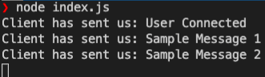

# Websocket client server javascript application

## Description

An application that creates a client server websocket application, which can be used for web and mobile testing of send websocket data.

#### Corresponding project

https://github.com/JPrendy/websocket-starscreams-ios-application

## Contents

- [Setup Steps](#setup-steps)
- [How to run the project locally](#how-to-run-the-project-locally)
- [Tools](#tools)
- [Update Dependencies](#update-dependencies)
- [Releases](#releases)
- [Helpful resources](#helpful-resources)

## Setup Steps

Go to the root of the project, open up the terminal and run the following

```javascript
npm init -y
npm i ws
```

You want something like the following in the `index.js` file where everytime we send data via websocket it will be broadcasted to all the other applications that is connected to the same websocket port, for this application we are using `ws://localhost:8082`.

```javascript
// A client WebSocket broadcasting to every other connected WebSocket clients, excluding itself.
wss.on('connection', function connection(ws) {
    ws.on('message', function incoming(data) {
        wss.clients.forEach(function each(client) {
            if (client !== ws) {
                client.send(data);
            }
        });
    });
});
```

Two things to note is all the data we are sending is on the `/` request, we can expand this application to return and send different data on different requests, to verify what we are seeing, you will see something in the browser.

<p></p>

<p></p>

You can also use Postman to send websocket requests, so when we connect to the websocket server `ws://localhost:8082` we can send messages. So if we send a message via Postman, we should also see it also being shown on the client side as well as in our server logs.

<p></p>

<p></p>

<p></p>

Once we are connected to the websocket server, we will also see in Postman any received messages that is done from the client side. So, when we press the button that sends `Sample Message 1` it is also shown in the Postman logs.

<p></p>

## How to run the project locally

Go to the root of the project, change into the folder called `server` and run the following in the terminal to launch the Websocket server, so the web client and mobile client can connect to it

```javascript
node index.js
```

Drag the `index.html` from the project and drag it in to your browser and you should see something like the following for your url `file:///Users/jamesprendergast/Documents/Github%20Projects/websocket-client-server-javascript-application/index.html`. Open up another window and you will see when you press a button, the content of the other page will also change and your logs on the server will be updated.

You want to see something like the following

<p></p>

<p></p>

## Tools

**Linter:** we use the following linter [link](https://github.com/github/super-linter).

**Uploading Artifacts:**  we use the following way to upload Artifacts, they allow you to persist data like test results after a job has completed, see the following documentation [link](https://docs.github.com/en/actions/configuring-and-managing-workflows/persisting-workflow-data-using-artifacts).

**Creating images/icons:** we use Figma to create images and icon. Figma makes it very easy to create designs in many different formats.

**Creating a Mock Server:** we use a mock server with Postman to quickly test apis, to see how to create a mock server, see the following video [link](https://www.youtube.com/watch?v=rJY8uUH2TIk). 

### Mobile Specific Tools:
 
**Fastlane:** Fastlane allows us to automate our development and release process [link](https://docs.fastlane.tools/).

**App Center:** App Center is used to distribute an app, making it very easy to test on a physical device by using a fastlane plugin [link](https://github.com/microsoft/fastlane-plugin-appcenter).

**Proxyman:** we use Proxyman to view HTTP/HTTPS requests as they happen, it is easier to debug network connections on mobile on Proxyman where we can test and mock specific network responses, see the following documentation [link](https://docs.proxyman.io/debug-devices/ios-simulator). 

## Update Dependencies

**Npm:** How to update a npm package.
- [link](https://docs.npmjs.com/cli/update).

**Gemfile:** How to update a Gemfile package.
- [link](https://bundler.io/man/bundle-update.1.html#UPDATING-A-LIST-OF-GEMS).

## Releases

How to manage releases in a repository [link](https://help.github.com/en/github/administering-a-repository/managing-releases-in-a-repository). 

## Helpful resources

The install websockets `ws` that we can use in this client server application, see the following npm documentation.
- [link](https://www.npmjs.com/package/ws).

The following video explains what are websockets and how they work, it is quite helpful.
- [link](https://www.youtube.com/watch?v=i5OVcTdt_OU).

The following video is helpful for setting up a websocket application like this one.
- [link](https://www.youtube.com/watch?v=FduLSXEHLng).

The following socket.io demo application is a good example of websockets and how they can be used.
- [link](https://socket.io/demos/whiteboard/).

The following is a good Mozilla documentation explaining websockets.
- [link](https://developer.mozilla.org/en-US/docs/Web/API/WebSockets_API/Writing_WebSocket_client_applications).